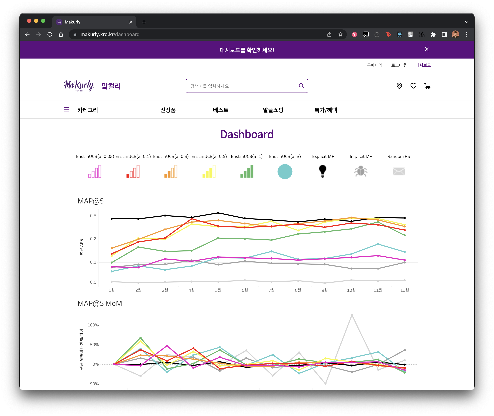
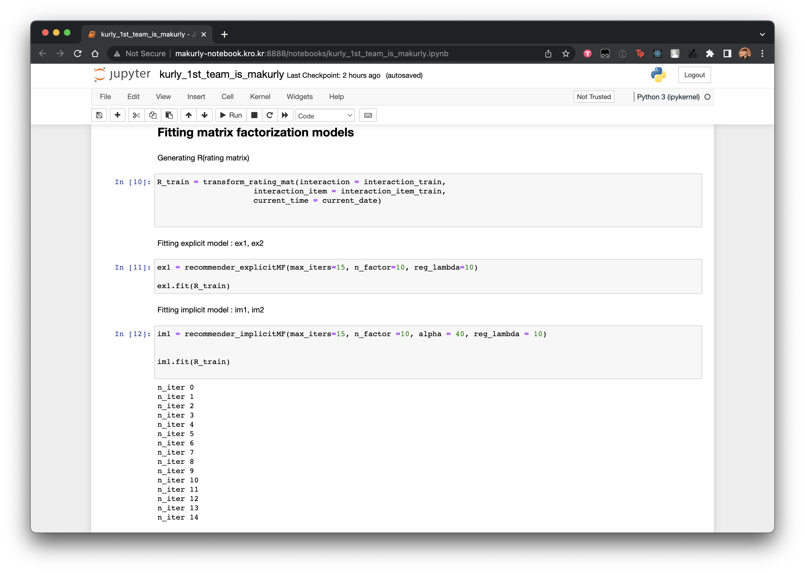

# 맠컬리 (Makurly) - 나만의 상점

KURLY HACK FESTA 2022 본선 맠컬리팀의 프로젝트입니다. 

👉 [저희 서비스를 이용해보세요!](https://makurly.kro.kr) 

    

## 설명

사용자가 makurly에서 구매한 제품을 바탕으로 새로운 제품을 추천합니다. 

## 서비스 사용 방법
**서비스에 접속하신 후, 최상단에 있는 배너의 설명대로 진행하셔도 괜찮습니다.** 

* 회원가입을 진행합니다. (개인정보는 서비스 종료시 모두 삭제할 예정입니다. 그리고 실제 정보가 아니라도 괜찮습니다.)
* 구매하고 싶은 제품을 장바구니에 담습니다. 제품의 수량도 선택하실 수 있습니다.
* 우측 상단에 보이는 장바구니 아이콘, 또는 최상단의 배너를 눌러 장바구니 페이지로 갑니다.
* 제품을 구매(하는 척)합니다. 실제로 결제되지 않습니다.
* 🥳 구매 완료! 🥳 여러분에게 어울리는 추천 상품 다섯개가 담겨있는 카드를 뒤집어보세요!
* 대시보드에 들어가서 저희가 학습시킨 모델에 대한 정보도 확인하실 수 있습니다.

### 위의 사용방법에 따른 흐름

     
    메인화면

     
    회원가입

     
    로그인 (회원가입시 입력한 이름만 입력하시면 됩니다.)

     
    장바구니에 맛있어 보이는 제품 담기

     
    장바구니 확인 및 구매

     
    구매완료

     
    나만의 상점 서비스로 제품 추천 받기

     
    우리 추천 모델의 성능 비교 대시보드 확인하기

## 추가 설명
**깃허브에 올리지 않은 정보나 파일이 있습니다.** 
**따라서 해당 레포지토리를 clone 한 뒤 실행해도 모든 애플리케이션이 돌아가지는 않습니다.**

### brain

     
    저 높은 구름 위에서 학습하는 우리의 소중한 모델들

* 저희 모델이 돌아가고 있는 서버와 관련된 디렉토리 입니다.
* 로컬 환경에서 app.py 를 실행하기 위해서는 python 3.9 버전과 infra 디렉토리에 있는 requirements.txt 관련 패키지가 필요합니다.

### frontend

     
    추천 제품을 하나씩 뒤집어보는 재미

* 서비스의 프론트엔드와 관련된 디렉토리입니다. 로컬 환경에서 실행 가능합니다.

### backend

* 서비스의 백엔드와 관련된 디렉토리입니다. 로컬 환경에서 실행 가능합니다.

### infra

     
    이건 인프라 구조입니다

     
    그리고 이건 우리 서비스의 ERD 입니다

* 서비스의 DB, CORS 처리, AWS 리소스 관리 등 환경 설정 등 인프라와 관련된 디렉토리입니다.
